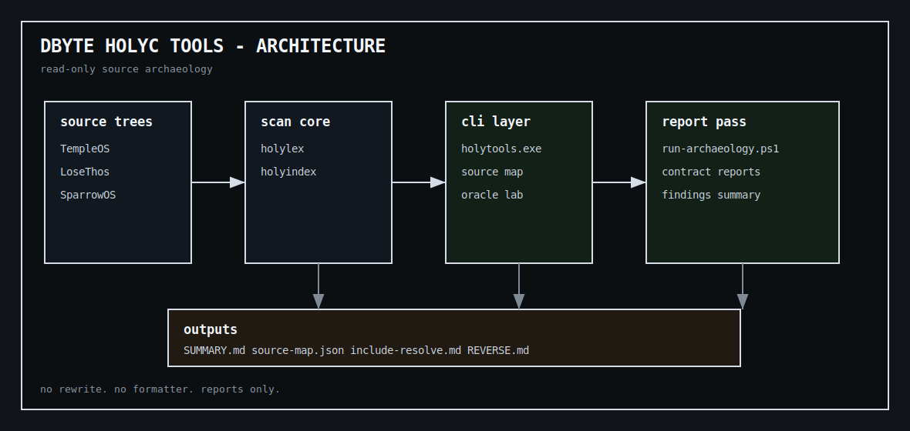

<h1>DBYTE HOLYC TOOLS</h1>

  Windows-native read-only source navigator, archaeology reporter, and oracle/random text lab for HolyC, LoseThos, SparrowOS, and TempleOS-style research.

  <strong>Current line:</strong> <code>v1.8.1 ORACLE VOICE</code>

<section>
  <h2>Architecture</h2>
  

    Clean terminal-board architecture map. It is a repo-authored SVG built from
    plain boxes, monospace labels, and fixed arrows. No generated artwork dependency.
  

  
  <pre>source trees
  -> holylex and holyindex
  -> holytools.exe
  -> report scripts
  -> archaeology reports

read-only scanner
no source rewrite
no source-tree mutation
no runtime proof claims</pre>
</section>

<section>
  <h2>Rule</h2>
  <pre>No source rewrite.
No formatter.
No VM.
No fake C parser.
No source-tree mutation.
Oracle output is random text lab output, not an authority claim.</pre>
</section>

<section>
  <h2>What it does</h2>
  

    It scans HolyC-style source, indexes symbols/includes, checks include resolution,
    finds likely entry files, emits deterministic text/JSON reports, builds
    read-only source archaeology maps, and provides a Windows-friendly random text lab.
  

</section>

<section>
  <h2>Commands</h2>
  <pre>holytools version
holytools scan &lt;path&gt; [--json]
holytools stats &lt;path&gt; [--json]
holytools source-map &lt;path&gt; [--json]
holytools missing-includes &lt;path&gt; [--json]
holytools entrypoints &lt;path&gt; [--json]
holytools tokens &lt;file&gt;
holytools outline &lt;file&gt; [--json]
holytools symbols &lt;path&gt; [--json]
holytools find-symbol &lt;path&gt; &lt;name&gt; [--json]
holytools includes &lt;path&gt; [--json]
holytools include-graph &lt;path&gt; [--json]
holytools resolve-includes &lt;path&gt; [--json]
holytools dependency-order &lt;path&gt; [--json]
holytools reverse-includes &lt;path&gt; [--json]
holytools oracle [--preset core|after-egypt] [--voice plain|uncle] [--count N] [--seed N] [--corpus file.txt] [--json]
holytools oracle-keymap</pre>
</section>

<section>
  <h2>Oracle Lab</h2>
  <pre>holytools oracle
holytools oracle --seed 777 --count 3
holytools oracle --preset after-egypt --seed 777
holytools oracle --preset after-egypt --voice uncle --count 3
holytools oracle --corpus my-lines.txt --voice uncle --count 5
holytools oracle --json
holytools oracle-keymap</pre>
  

    The oracle command is a TempleOS-inspired random text research tool. Voice mode is a display skin over random text, not an authority claim.
  

</section>

<section>
  <h2>Build</h2>
  <pre>cargo build --release -p holytools</pre>
  
Binary:

  <pre>target/release/holytools.exe</pre>
</section>

<section>
  <h2>Fast path</h2>
  <pre>holytools source-map tests/fixtures/tiny
holytools missing-includes tests/fixtures/tiny
holytools entrypoints tests/fixtures/tiny
holytools oracle --preset after-egypt --voice uncle --seed 7 --count 2</pre>
</section>

<section>
  <h2>Report pack</h2>
  <pre>./scripts/report.ps1 tests/fixtures/tiny reports/tiny</pre>
  <table>
    <tr><td>version.txt</td></tr>
    <tr><td>source-map.txt</td></tr>
    <tr><td>source-map.json</td></tr>
    <tr><td>missing-includes.txt</td></tr>
    <tr><td>missing-includes.json</td></tr>
    <tr><td>entrypoints.txt</td></tr>
    <tr><td>entrypoints.json</td></tr>
    <tr><td>dependency-order.txt</td></tr>
    <tr><td>dependency-order.json</td></tr>
    <tr><td>reverse-includes.txt</td></tr>
    <tr><td>reverse-includes.json</td></tr>
  </table>
</section>

<section>
  <h2>Source archaeology</h2>
  <pre>./scripts/run-archaeology.ps1 -TempleOS D:/src/TempleOS
./scripts/run-archaeology.ps1 -TempleOS D:/src/TempleOS -LoseThos D:/src/LoseThos -SparrowOS D:/src/SparrowOS</pre>
  
Output:

  <pre>reports/archaeology/SUMMARY.md
reports/archaeology/templeos/
reports/archaeology/losethos/
reports/archaeology/sparrowos/</pre>
</section>

<section>
  <h2>TempleOS archaeology evidence</h2>
  <table>
    <tr><td>include-resolve.md</td><td>include resolver proof</td></tr>
    <tr><td>REVERSE.md</td><td>reverse include pressure</td></tr>
    <tr><td>BOOT-CHAIN.md</td><td>StartOS source load chain</td></tr>
    <tr><td>SPINE.md</td><td>root outline checkpoints</td></tr>
    <tr><td>KERNEL-CONTRACT.md</td><td>KernelA public contract map</td></tr>
    <tr><td>COMPILER-CONTRACT.md</td><td>CompilerA/B contract map</td></tr>
    <tr><td>ADAM-MANIFEST.md</td><td>Adam top-level manifest</td></tr>
    <tr><td>DESKTOP-SURFACE.md</td><td>Adam desktop and UI surface</td></tr>
    <tr><td>ADAM-SUBSYSTEMS.md</td><td>second-level Adam subsystem manifests</td></tr>
    <tr><td>ARCHAEOLOGY-FINDINGS.md</td><td>single-page findings summary</td></tr>
  </table>
</section>

<section>
  <h2>LoseThos archaeology evidence</h2>
  <table>
    <tr><td>include-resolve.md</td><td>legacy include alias resolver proof</td></tr>
    <tr><td>REVERSE.md</td><td>reverse include pressure and gate hotspots</td></tr>
    <tr><td>BOOT-CHAIN.md</td><td>load-chain checkpoints without TempleOS StartOS assumption</td></tr>
    <tr><td>SPINE.md</td><td>root outline checkpoints</td></tr>
    <tr><td>LOSETHOS-CONTRACT.md</td><td>OSMain, compiler, Adam, and boot-media source-contract map</td></tr>
    <tr><td>ARCHAEOLOGY-FINDINGS.md</td><td>single-page findings summary</td></tr>
  </table>
</section>

<section>
  <h2>Known TempleOS proof line</h2>
  <pre>includes: 229
resolved-includes: 229
missing-includes: 0
pipeline: ok</pre>
</section>

<section>
  <h2>Known LoseThos proof line</h2>
  <pre>holy-files: 119
tokens: 408900
functions: 1461
classes: 118
includes: 81
resolved-includes: 81
missing-includes: 0
pipeline: ok</pre>
</section>

<section>
  <h2>Package</h2>
  <pre>./scripts/package-windows.ps1
./scripts/verify-package.ps1
./scripts/package-zip.ps1</pre>
  
Output:

  <pre>dist/dbyte-holyc-tools-windows/
dist/dbyte-holyc-tools-windows.zip
dist/dbyte-holyc-tools-windows.zip.sha256</pre>
</section>

<section>
  <h2>Package contents</h2>
  <pre>holytools.exe
README.md
CHANGELOG.md
VERSION.txt
SHA256SUMS.txt
MANIFEST.txt
scripts/check-includes.ps1
scripts/report.ps1
scripts/resolve-archaeology-includes.ps1
scripts/reverse-archaeology.ps1
scripts/boot-chain-archaeology.ps1
scripts/spine-archaeology.ps1
scripts/kernel-contract-archaeology.ps1
scripts/compiler-contract-archaeology.ps1
scripts/adam-manifest-archaeology.ps1
scripts/desktop-surface-archaeology.ps1
scripts/adam-subsystems-archaeology.ps1
scripts/losethos-contract-archaeology.ps1
scripts/archaeology-findings.ps1
scripts/summarize-archaeology.ps1
scripts/run-archaeology.ps1</pre>
</section>

<section>
  <h2>Release gate</h2>
  <pre>./scripts/release.ps1 v1.8.1</pre>
  

    The gate runs format check, workspace check, tests, CLI verification,
    package verification, ZIP creation, clean tree check, and tag push.
  

</section>

<section>
  <h2>Verify</h2>
  <pre>./scripts/verify.ps1</pre>
  
Current smoke line:

  <pre>14 cli smoke tests</pre>
</section>

<section>
  <h2>Final stance</h2>
  <pre>read-only by default
HolyC compatibility first
deterministic output when seeded
source archaeology without source mutation
oracle/random text lab without authority claims
voice skins without authority claims</pre>
</section>
